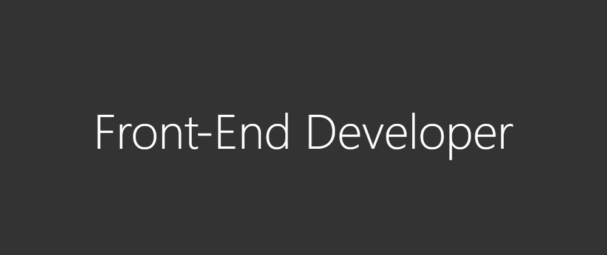

<h1 align="center">
  
</h1>

** Hello
I'm Deyvi, and I'm in the process of becoming a "Front-End Developer".

** Frontend technologies
  

      
        
      
      
        
      
      
        
      
  

** Softwares and Tools:
  

    
      
    
    
      
    
    
      
    
    
      
    
  

** Cloud and Database
    

      
        
            
    

** Frameworks - Actually Learning    
    

      
         
      
      
         
      
    

** Social Media    
    

      
        
     
     
        
     
   

